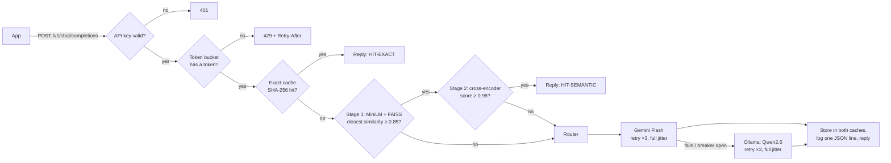
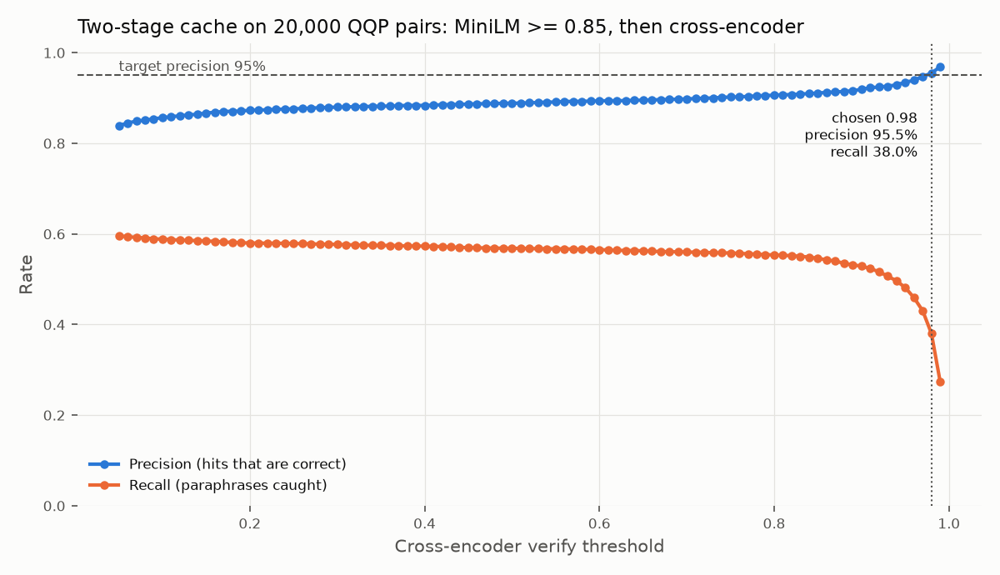

# LLM API Gateway

An OpenAI-compatible gateway that makes LLM calls cheaper, safer and more reliable, with a two-stage semantic cache, per-key rate limiting and automatic provider fallback.

[](https://github.com/nivi9944/llm-gateway/actions/workflows/ci.yml)

[](LICENSE)

`FastAPI` · `httpx` (async) · `Redis` + `Lua` · `FAISS` · `sentence-transformers` · `Docker` · `pytest` · `Locust`

---

## Overview

LLM calls are slow, cost money per token, and fail in ways an application has to handle: rate limits,
timeouts and outages. This gateway sits between applications and LLM providers and speaks the OpenAI
chat format, so any OpenAI SDK works by changing one line (`base_url`). It answers repeated and
paraphrased questions from a cache, limits each client key with a token bucket, and retries, falls back
and trips a circuit breaker when a provider misbehaves. Every request is logged with its cache status,
provider, latency and estimated cost.

## Key results

<!-- KEY:START -->

| Metric | Result | Source |
|---|---|---|
| Semantic-cache hit precision (20,000 labelled question pairs) | 95.5% | `results/qqp_threshold.json` |
| Paraphrase recall: single-stage embedding → two-stage | 7.6% → 38.0% | `results/qqp_threshold_single_stage.json`, `results/qqp_threshold.json` |
| Cache hit rate / estimated LLM spend saved (10,000-request replay) | 28.8% / 28.7% | `results/replay.json` |
| Cache hits that returned a correct answer | 98.2% | `results/replay.json` |
| Success rate at 30% provider faults: protected vs unprotected | 100.0% vs 71.0% | `results/chaos.json` |
| p95 gateway overhead at 50 concurrent users: baseline → optimized | 1270 → 332 ms (73% lower) | `results/load_baseline.json`, `results/load.json` |
| Throughput (50 users, 800 ms provider latency) | 52.8 req/s | `results/load.json` |
| Automated tests | 61 passing | `results/tests.json` |

<!-- KEY:END -->

Measured with the benchmarks in `bench/`; see [Benchmarks and methodology](#benchmarks-and-methodology).

---

## Architecture

The cheapest checks run first, so a rejected or cached request never costs a provider call.



## How it works

**Authentication.** Clients send `Authorization: Bearer <key>`. Keys come from `GATEWAY_KEYS` and are
compared in constant time. Logs record a short hash of the key, never the key itself.
(`gateway/auth.py`)

**Rate limiting.** Each key has a token bucket stored in Redis: a burst capacity plus a steady refill
rate. The check-and-take step is a single Lua script, so it is atomic even with several gateway
replicas, and it uses Redis's clock so replicas agree. Over the limit, the gateway returns 429 with
`Retry-After`. (`gateway/ratelimit.py`)

**Exact cache.** The key is a SHA-256 hash of the messages plus every parameter that can change the
answer (model, temperature, `max_tokens`, tools, and so on), stored in Redis with a TTL. Only
`temperature: 0` requests are cached, because other temperatures are meant to vary.
(`gateway/cache.py`)

**Two-stage semantic cache.** Catches paraphrases such as "How do I learn Python fast?" and "Quickest
way to learn Python?".
1. MiniLM embeds the last user message and FAISS finds the closest cached question from the same
   conversation context. Embedding requests that arrive within 5 ms are batched into one model call on a
   dedicated thread pool.
2. If that candidate is similar enough, a cross-encoder reads both questions together and decides
   whether they really mean the same thing. Only then is the cached answer reused.

A failed or unavailable check counts as a miss, never as an unchecked hit.
(`gateway/semantic_cache.py`)

**Retries with full jitter.** Timeouts, connection errors and 429/5xx responses are retried with
exponential backoff and a random wait between 0 and the backoff limit, so clients that failed together
do not retry together. A provider's `Retry-After` is honoured. (`gateway/router.py`)

**Fallback.** Providers are tried in order: Gemini first, then a local Ollama model. Client errors
(400/422) are returned immediately; provider-specific errors (such as a bad key) move on to the next
provider.

**Circuit breaker.** After 5 consecutive failures, a provider is skipped for 30 seconds, then a single
test request decides whether it is healthy again. During an outage this stops the gateway from wasting
time on a dead provider. (`gateway/breaker.py`)

**Metrics.** One JSON log line per request (cache status, provider, similarity, latency, tokens,
estimated cost and savings), plus running totals at `/metrics-summary`. (`gateway/metrics.py`)

**Fail open.** If Redis goes down, the gateway keeps answering every request without caching or rate
limiting, instead of failing.

## Models used

| Model | Role | Why this one |
|---|---|---|
| `sentence-transformers/all-MiniLM-L6-v2` | Embeds questions for the stage-1 semantic search | Small (384 dimensions) and fast on CPU, good general-purpose sentence similarity |
| `cross-encoder/quora-distilroberta-base` | Stage-2 check: scores whether two questions mean the same | Trained on duplicate-question detection, and reads both questions together, so it catches meaning changes an embedding misses |
| Gemini Flash (`gemini-3.6-flash` by default) | Main LLM | Fast, low-cost hosted model with an OpenAI-compatible endpoint and a free tier |
| Qwen2.5 (`qwen2.5:7b`) via Ollama | Local fallback LLM | Runs on the host with no network or API key, so answers keep flowing when the cloud provider fails |

---

## Benchmarks and methodology

All numbers are produced by scripts in `bench/`, saved to `results/*.json`, and copied into this README
by `python bench/summarize.py`. The load, chaos and replay benchmarks run against a mock provider, so
they are repeatable and faults can be injected on purpose. Every result file records the machine it ran
on.

**Cache precision and recall (`bench/qqp_threshold.py`).** 20,000 human-labelled question pairs from
Quora Question Pairs (GLUE QQP, validation split). For each pair we check whether the cache would treat
the two questions as the same, and compare with the label. Precision is the share of would-be cache hits
that are truly the same question; recall is the share of true paraphrases the cache would catch. The
thresholds are chosen from this data: the candidate threshold is fixed at 0.85, and the cross-encoder
threshold is the lowest one reaching 95% precision.



**Replay (`bench/replay.py`).** 10,000 requests built from QQP *train* questions, excluding any pair
that shares a question with the validation split, so tuning and testing never see the same text. The
requested mix is 40% new questions, 20% exact repeats, 20% human-labelled paraphrases and 20% "near
misses" (questions that look similar but are labelled different). Every cache hit is checked against the
labels, so the benchmark reports how many cached answers were actually correct, not just how many hits
there were. Cost savings are estimated from token counts at the Gemini paid-tier list price.

**Load (`bench/load.py`).** Locust with 50 concurrent users for 60 seconds against a mock provider
with 800 ms latency. Every request is unique, so each one takes the full path (embedding, search,
provider call). Gateway overhead is the difference between going through the gateway and calling the
mock directly under the same load, at the same percentile. Throughput here is capped by the test design
(50 users ÷ 0.8 s), so it shows the gateway is not the bottleneck rather than its maximum.

**Chaos (`bench/chaos.py`).** 2,000 requests per scenario. The primary provider fails 30% of the time,
or 100% for the outage scenarios. "Protected" means retries, fallback and the circuit breaker are on.

### Design comparisons

<!-- COMPARE:START -->

**Semantic cache: single-stage vs two-stage** (`results/qqp_threshold_single_stage.json`, `results/replay_single_stage.json` vs `results/qqp_threshold.json`, `results/replay.json`)

| Metric | Single-stage (MiniLM only) | Two-stage (MiniLM + cross-encoder) |
|---|---|---|
| Threshold(s) | 0.98 | 0.85 / 0.98 |
| QQP hit precision | 92.4% | 95.5% |
| QQP paraphrase recall | 7.6% | 38.0% |
| QQP false-hit rate | 0.36% | 1.04% |
| Replay hit rate | 22.6% | 28.8% |
| Replay paraphrases served from cache | 10.8% | 40.5% |
| Replay semantic hits correct | 95.9% | 95.0% |
| Replay all hits correct | 99.6% | 98.2% |
| Replay wrong answers served | 10 of 10,000 | 51 of 10,000 |
| Replay estimated spend saved | 22.5% | 28.7% |

**Load path: baseline vs optimized** (each column adds one change to the one before; files: `results/load_baseline.json`, `results/load_threadpool_only.json`, `results/load_threadpool_batching.json`, `results/load_optimized.json`)

| Metric | Baseline | + dedicated thread pool | + micro-batching | + cross-encoder check (final) |
|---|---|---|---|---|
| Throughput | 35.3 req/s | 47.3 req/s | 52.3 req/s | 52.8 req/s |
| Gateway overhead p50 | 501.3 ms | 215.5 ms | 125.3 ms | 117.5 ms |
| Gateway overhead p95 | 1270.1 ms | 529.4 ms | 268.9 ms | 332.4 ms |
| Gateway overhead p99 | 1765.1 ms | 705.9 ms | 425.8 ms | 490.1 ms |
| In-gateway time p95 | 584.1 ms | 410.1 ms | 190.7 ms | 210.4 ms |
| Success rate | 100.0% | 100.0% | 100.0% | 100.0% |

<!-- COMPARE:END -->

### Caveats

* Hit rate and savings depend on the replay mix, which is an assumption about an FAQ-like workload.
  The realised mix is saved in `results/replay.json`.
* Costs are estimates at list price; free-tier calls actually cost nothing.
* The cross-encoder was trained on QQP *train* and is evaluated here on QQP *validation*. The data is
  separate, but the question style is the same, so real traffic may score lower.
* The two-stage cache reuses more answers but also serves more wrong ones than the embedding-only cache
  (see "Replay wrong answers served" above).

### Full results

<!-- RESULTS:START -->

Measured on: Windows-11-10.0.26200-SP0, 18 logical CPUs, 16.6 GB RAM, Python 3.12.10.

| Metric | Value | Source |
|---|---|---|
| Semantic cache: MiniLM candidate / cross-encoder threshold | 0.85 / 0.98 | `results/qqp_threshold.json` |
| Hit precision at threshold | 95.5% | `results/qqp_threshold.json` |
| Paraphrase recall at threshold | 38.0% | `results/qqp_threshold.json` |
| False-hit rate (different-meaning pairs matched) | 1.04% | `results/qqp_threshold.json` |
| QQP pairs evaluated | 20,000 | `results/qqp_threshold.json` |
| Replay: overall cache hit rate | 28.8% | `results/replay.json` |
| Replay: exact / semantic hit rate | 20.4% / 8.5% | `results/replay.json` |
| Replay: semantic hits that were correct | 95.0% | `results/replay.json` |
| Replay: all cache hits that were correct | 98.2% | `results/replay.json` |
| Replay: paraphrases served from cache | 40.5% | `results/replay.json` |
| Replay: estimated LLM spend saved | 28.7% | `results/replay.json` |
| Replay workload mix (unique / near-miss / exact / paraphrase) | 41% / 20% / 20% / 19% | `results/replay.json` |
| Load: throughput (50 users, 800 ms provider) | 52.8 req/s | `results/load.json` |
| Load: end-to-end p50 / p95 / p99 | 925 / 1153 / 1317 ms | `results/load.json` |
| Load: gateway overhead p50 / p95 / p99 (vs direct) | 117.5 / 332.4 / 490.1 ms | `results/load.json` |
| Load: in-gateway time p95 (log: latency - upstream) | 210.4 ms | `results/load.json` |
| Load: success rate | 100.00% | `results/load.json` |
| Chaos (30% failures): success without / with protection | 71.0% / 100.0% | `results/chaos.json` |
| Chaos (outage): calls to dead provider, no breaker / breaker | 6,000 / 20 | `results/chaos.json` |
| Chaos (outage): p95 latency, no breaker / breaker | 872 / 139 ms | `results/chaos.json` |
| Automated tests passing | 61 of 61 | `results/tests.json` |

<!-- RESULTS:END -->

---

## Quick start (Docker)

Requires Docker, and optionally a Gemini API key from [aistudio.google.com](https://aistudio.google.com)
and [Ollama](https://ollama.com) for the local fallback.

```bash
git clone https://github.com/nivi9944/llm-gateway.git
cd llm-gateway
cp .env.example .env          # then set GEMINI_API_KEY in .env
ollama pull qwen2.5:7b        # optional local fallback (qwen2.5:3b for 8 GB of RAM)
docker compose up -d --build  # gateway on :8000, Redis on :6379, mock provider on :9000
curl http://localhost:8000/health
```

On Windows PowerShell, use `Copy-Item .env.example .env` and `curl.exe`.

## API usage

With curl:

```bash
curl -i http://localhost:8000/v1/chat/completions \
  -H "Authorization: Bearer dev-key-1" \
  -H "Content-Type: application/json" \
  -d '{"model": "auto", "temperature": 0, "messages": [{"role": "user", "content": "What is a token bucket?"}]}'
```

With the official OpenAI SDK (only `base_url` changes):

```python
from openai import OpenAI

client = OpenAI(base_url="http://localhost:8000/v1", api_key="dev-key-1")
r = client.chat.completions.with_raw_response.create(
    model="auto", temperature=0,
    messages=[{"role": "user", "content": "What is a token bucket?"}],
)
print(r.headers["x-cache"], r.headers["x-provider"])
print(r.parse().choices[0].message.content)
```

**Response headers**

| Header | Meaning |
|---|---|
| `X-Cache` | `HIT-EXACT`, `HIT-SEMANTIC` or `MISS` |
| `X-Similarity` | cosine similarity of the closest cached question (when the semantic cache was checked) |
| `X-Verify-Score` | cross-encoder score for that candidate (when the stage-2 check ran) |
| `X-Provider` | `gemini`, `ollama`, `mock` or `cache` |
| `X-Latency-Ms` | time spent inside the gateway, including the provider call |
| `X-Upstream-Ms`, `X-Attempts` | time waiting on providers, and how many provider calls were made |
| `Retry-After` | on 429 (rate limited) and 503 (every provider's breaker open) |

**Request headers:** `X-Cache-Bypass: true` skips both caches; `X-Provider-Force: ollama` sends the
request to one provider only.

**Endpoints:** `POST /v1/chat/completions` · `GET /health` (public) · `GET /metrics-summary` (needs a key)

## Configuration

All settings are environment variables (see `.env.example` and `gateway/config.py`). The main ones:

| Variable | Default | Meaning |
|---|---|---|
| `GATEWAY_KEYS` | `dev-key-1,dev-key-2` | client keys allowed in |
| `PROVIDER_ORDER` | `gemini,ollama` | providers tried left to right |
| `GEMINI_API_KEY` / `GEMINI_MODEL` | empty / `gemini-3.6-flash` | Gemini credentials and model |
| `OLLAMA_MODEL` | `qwen2.5:7b` | local fallback model |
| `SEMANTIC_VERIFY_ENABLED` | `true` | two-stage semantic cache (`false` = embedding only) |
| `SEMANTIC_CANDIDATE_THRESHOLD` | `0.85` | stage 1: minimum MiniLM similarity for a candidate |
| `SEMANTIC_VERIFY_THRESHOLD` | `0.5` (`.env.example`: `0.98`) | stage 2: minimum cross-encoder score; set from `results/qqp_threshold.json` |
| `SEMANTIC_THRESHOLD` | `0.90` (`.env.example`: `0.98`) | embedding-only threshold, used when verification is off |
| `CACHE_TTL_SECONDS` | `86400` | how long answers are kept |
| `BUCKET_CAPACITY` / `REFILL_PER_SEC` | `10` / `0.1667` | burst size / sustained rate per key |
| `RETRY_MAX` | `3` | tries per provider |
| `BREAKER_FAILS` / `BREAKER_COOLDOWN_S` | `5` / `30` | circuit breaker |
| `PRICE_INPUT_PER_M` / `PRICE_OUTPUT_PER_M` | `0.75` / `3.75` | USD per 1M tokens for the cost estimate |

## Running tests and benchmarks

```bash
python -m venv .venv && source .venv/bin/activate   # Windows: .\.venv\Scripts\Activate.ps1
pip install -r requirements-dev.txt

pytest -q                                            # offline: fake providers, fakeredis, fake models
TEST_REDIS_URL=redis://localhost:6379/2 pytest -q    # same suite against a real Redis
```

Benchmarks need Redis (`docker compose up -d redis`); each writes `results/<name>.json`:

```bash
python bench/test_report.py                 # results/tests.json
python bench/qqp_threshold.py --two-stage   # results/qqp_threshold.json + .png (5-10 min on CPU)
python bench/replay.py                      # results/replay.json (--no-verify for embedding only)
python bench/load.py                        # results/load.json (about 2.5 min)
python bench/chaos.py                       # results/chaos.json (about 1.5 min)
python bench/summarize.py                   # refreshes the tables in this README
```

Every script has `--help`. `qqp_threshold.py` and `replay.py` also have `--smoke`, a tiny offline check.

## Project structure

```
gateway/          the service
  main.py           app factory and request flow
  config.py         all settings (environment / .env)
  auth.py           API key check
  ratelimit.py      token bucket (Redis Lua script)
  cache.py          exact cache and message normalisation
  semantic_cache.py embedder, micro-batcher, FAISS index, cross-encoder check
  router.py         providers, retries with full jitter, fallback
  breaker.py        circuit breaker
  metrics.py        JSON request log, cost estimate, /metrics-summary
mock_provider/    fake OpenAI-format LLM with adjustable latency and failure rate
bench/            benchmarks; each writes results/<name>.json
results/          benchmark output: the only source of the numbers in this README
tests/            pytest suite (runs offline)
DECISIONS.md      design decisions and trade-offs
```

## Limitations and future work

* FAISS lives in each gateway process and is rebuilt from Redis at start-up. With many replicas, a
  shared vector store (Redis vector search, pgvector, Qdrant) would keep them in sync.
* The cross-encoder checks only the single best candidate. Checking the top few would catch more
  paraphrases at some extra latency.
* No streaming responses yet (`stream: true` returns 400).
* One Uvicorn worker. To scale: more workers or replicas behind a load balancer, and Redis Cluster.
* Cost figures are estimates at list price, not a bill.
* The Gemini free tier may use prompts to improve Google's products, so only public data (Quora
  questions) was sent to it during testing.

See [DECISIONS.md](DECISIONS.md) for the reasoning behind each design choice.

## License

MIT. See [LICENSE](LICENSE).
