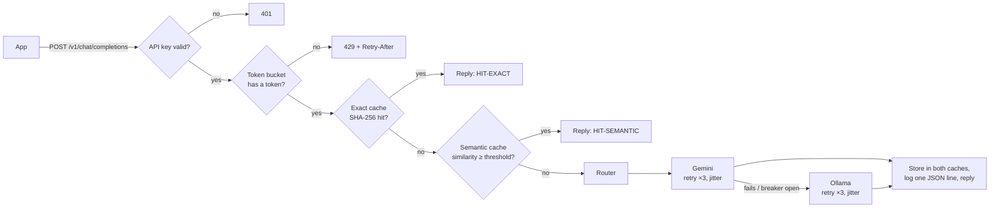

# LLM API Gateway

An async API gateway that sits between your apps and LLM providers and makes every LLM call
**cheaper** (exact + semantic caching), **fairer** (per-key rate limiting), **more reliable**
(retries, fallback, circuit breaker) and **observable** (per-request cost and latency logs).

It speaks the **OpenAI chat format**, so any OpenAI SDK works by changing one line (`base_url`).
Main provider: **Gemini** (free tier). Fallback: **Ollama** running locally.

`FastAPI` · `httpx` (async) · `Redis` + `Lua` · `FAISS` · `sentence-transformers` · `Docker` · `pytest` · `Locust`

---

## How a request flows

The cheapest checks run first, so a rejected or cached request never costs a provider call.



| Step | What it does | Where |
|---|---|---|
| Auth | `Authorization: Bearer <key>` must be in `GATEWAY_KEYS`, compared in constant time | `gateway/auth.py` |
| Rate limit | Token bucket per key in Redis. One **Lua script**, so it is atomic across replicas | `gateway/ratelimit.py` |
| Exact cache | SHA-256 of the messages + every parameter that can change the answer (model, temperature, max_tokens, tools, …) → Redis, with TTL | `gateway/cache.py` |
| Semantic cache | MiniLM embeds the last user message; FAISS finds the closest earlier one. Matches only among requests with the same parameters and earlier conversation | `gateway/semantic_cache.py` |
| Router | Retries timeouts / 429 / 5xx with exponential backoff + **full jitter**; falls back to the next provider | `gateway/router.py` |
| Circuit breaker | 5 failures in a row → skip the provider for 30 s → one test request decides | `gateway/breaker.py` |
| Metrics | One JSON log line per request; `/metrics-summary` totals; estimated cost | `gateway/metrics.py` |

Only `temperature: 0` requests are cached (other temperatures are meant to vary).
If Redis goes down, the gateway **fails open**: no caching or rate limiting, but every request is still answered.

---

## Results

Every number below is generated by a script in `bench/` into `results/*.json` and copied into
this table by `python bench/summarize.py`. Nothing is typed by hand.

<!-- RESULTS:START -->

Measured on: Windows-11-10.0.26200-SP0, 18 logical CPUs, 16.6 GB RAM, Python 3.12.10, 2026-09-24T12:05:52+00:00.

| Metric | Value | Source |
|---|---|---|
| Semantic threshold (chosen) | 0.98 (95% target NOT met) | `results/qqp_threshold.json` |
| Hit precision at threshold | 92.4% | `results/qqp_threshold.json` |
| Paraphrase recall at threshold | 7.6% | `results/qqp_threshold.json` |
| False-hit rate (different-meaning pairs matched) | 0.36% | `results/qqp_threshold.json` |
| QQP pairs evaluated | 20,000 | `results/qqp_threshold.json` |
| Replay: overall cache hit rate | 22.6% | `results/replay.json` |
| Replay: exact / semantic hit rate | 20.4% / 2.2% | `results/replay.json` |
| Replay: semantic hits that were correct | 95.9% | `results/replay.json` |
| Replay: all cache hits that were correct | 99.6% | `results/replay.json` |
| Replay: estimated LLM spend saved | 22.5% | `results/replay.json` |
| Replay workload mix (unique / near-miss / exact / paraphrase) | 41% / 20% / 20% / 19% | `results/replay.json` |
| Load: throughput (50 users, 800 ms provider) | 47.3 req/s | `results/load.json` |
| Load: end-to-end p50 / p95 / p99 | 1025 / 1353 / 1536 ms | `results/load.json` |
| Load: gateway overhead p50 / p95 / p99 (vs direct) | 215.5 / 529.4 / 705.9 ms | `results/load.json` |
| Load: in-gateway time p95 (log: latency - upstream) | 410.1 ms | `results/load.json` |
| Load: success rate | 100.00% | `results/load.json` |
| Chaos (30% failures): success without / with protection | 71.0% / 100.0% | `results/chaos.json` |
| Chaos (outage): calls to dead provider, no breaker / breaker | 6,000 / 20 | `results/chaos.json` |
| Chaos (outage): p95 latency, no breaker / breaker | 872 / 139 ms | `results/chaos.json` |
| Automated tests passing | 52 of 52 | `results/tests.json` |

<!-- RESULTS:END -->

**How to read them**

* **Threshold** — swept 0.80–0.99 on labelled Quora Question Pairs (GLUE QQP, validation split);
  the chosen value is the lowest one whose hit precision is ≥ 95%.
* **Replay** — 10,000 requests built from QQP *train* questions (never used for tuning), with a stated
  mix of new questions, exact repeats, human-labelled paraphrases and "near-miss" questions that look
  similar but mean something different. Hit rate depends on that mix, which is saved in `replay.json`.
  Every cache hit is checked: it counts as correct only if QQP's labels say the new question and the
  one that produced the cached answer mean the same thing.
* **Cost** — tokens × the Gemini paid-tier list price in `gateway/config.py`. It is an estimate:
  free-tier calls really cost 0.
* **Load** — Locust, 50 users, 60 s, mock provider with 800 ms latency, every request unique (full
  path). Overhead = (through gateway) − (straight to the mock) at the same percentile. Requests/s in
  this setup is capped by users ÷ latency (50 ÷ 0.8 s ≈ 62), so it shows the gateway is not the
  bottleneck, not its maximum. For a capacity test: `python bench/load.py --latency-ms 50 --users 200 --out results/capacity`.
* **Chaos** — 2,000 requests per scenario; the primary fails 30% of the time (or 100%, for the outage
  scenarios). "Protection" = retries + fallback + breaker.

---

## Quick start (Windows, PowerShell)

Needs Docker Desktop, Python 3.11+, and optionally Ollama and a Gemini API key from
[aistudio.google.com](https://aistudio.google.com).

```powershell
git clone https://github.com/nivi9944/llm-gateway.git
cd llm-gateway
Copy-Item .env.example .env        # then open .env and paste GEMINI_API_KEY
ollama pull qwen2.5:7b             # or qwen2.5:3b on an 8 GB laptop
docker compose up -d --build
Invoke-RestMethod http://localhost:8000/health
```

Send a request (PowerShell):

```powershell
$body = @{ model = "auto"; temperature = 0;
           messages = @(@{ role = "user"; content = "What is a token bucket?" }) } | ConvertTo-Json -Depth 5
Invoke-WebRequest http://localhost:8000/v1/chat/completions -Method Post -Body $body `
  -ContentType "application/json" -Headers @{ Authorization = "Bearer dev-key-1" } |
  Select-Object -ExpandProperty Headers
```

Or from Python with the official OpenAI SDK — only `base_url` changes:

```python
from openai import OpenAI

client = OpenAI(base_url="http://localhost:8000/v1", api_key="dev-key-1")
r = client.chat.completions.with_raw_response.create(
    model="auto", temperature=0,
    messages=[{"role": "user", "content": "What is a token bucket?"}],
)
print(r.headers["x-cache"], r.headers["x-provider"])
print(r.parse().choices[0].message.content)
```

### Response headers

| Header | Meaning |
|---|---|
| `X-Cache` | `HIT-EXACT`, `HIT-SEMANTIC` or `MISS` |
| `X-Similarity` | cosine similarity of the closest cached question (when the semantic cache was checked) |
| `X-Provider` | `gemini`, `ollama`, `mock` or `cache` |
| `X-Latency-Ms` | time spent inside the gateway, including the provider call |
| `X-Upstream-Ms`, `X-Attempts` | time waiting on providers, and how many provider calls were made |
| `Retry-After` | on 429 (rate limited) and 503 (all breakers open) |

### Request headers

| Header | Effect |
|---|---|
| `X-Cache-Bypass: true` | skip both caches for this request |
| `X-Provider-Force: ollama` | send to one provider only (handy for demos) |

### Endpoints

`POST /v1/chat/completions` · `GET /health` (public) · `GET /metrics-summary` (needs a key)

---

## Reproduce the numbers

```powershell
python -m venv .venv; .\.venv\Scripts\Activate.ps1
pip install -r requirements-dev.txt
docker compose up -d redis                 # benchmarks use Redis db 1 on localhost:6379

python bench/test_report.py                # -> results/tests.json
python bench/qqp_threshold.py              # -> results/qqp_threshold.json + .png  (~5-10 min on CPU)
python bench/replay.py                     # -> results/replay.json
python bench/load.py                       # -> results/load.json   (~2.5 min)
python bench/chaos.py                      # -> results/chaos.json  (~1.5 min)
python bench/summarize.py                  # fills the Results table above
```

Every script has `--help`. `qqp_threshold.py` and `replay.py` also have `--smoke` (tiny, offline, writes to `trial_results/`, not for real use).

## Run the tests

```powershell
pytest -q                                   # ~10 s, no network needed (fakeredis + fake providers)
$env:TEST_REDIS_URL="redis://localhost:6379/2"; pytest -q   # same tests on a real Redis
```

---

## Configuration

All settings are environment variables (see `.env.example` and `gateway/config.py`).
The important ones:

| Variable | Default | Meaning |
|---|---|---|
| `GATEWAY_KEYS` | `dev-key-1,dev-key-2` | client keys allowed in |
| `PROVIDER_ORDER` | `gemini,ollama` | providers tried left to right (`mock`, `mock2` for tests) |
| `SEMANTIC_THRESHOLD` | `0.90` | set from `results/qqp_threshold.json` |
| `CACHE_TTL_SECONDS` | `86400` | how long answers are kept |
| `BUCKET_CAPACITY` / `REFILL_PER_SEC` | `10` / `0.1667` | burst size / sustained rate per key |
| `RETRY_MAX` | `3` | tries per provider |
| `BREAKER_FAILS` / `BREAKER_COOLDOWN_S` | `5` / `30` | circuit breaker |
| `PRICE_INPUT_PER_M` / `PRICE_OUTPUT_PER_M` | `0.75` / `3.75` | USD per 1M tokens for the cost estimate |

## Project layout

```
gateway/        the service (main.py wires everything together)
mock_provider/  fake OpenAI-format LLM with adjustable latency and failure rate
bench/          benchmark scripts; each writes results/<name>.json
results/        the ONLY source of numbers quoted anywhere
tests/          pytest suite (runs offline)
```

## Limitations and what I would do at larger scale

* FAISS lives in each gateway process (rebuilt from Redis at start-up). With many replicas, a shared
  vector store (Redis vector search, pgvector, Qdrant) would keep them in sync.
* No streaming responses yet (`stream: true` returns 400).
* One Uvicorn worker. To scale: more workers or replicas behind a load balancer, Redis Cluster.
* Cost figures are estimates at list price, not a bill.

See `DECISIONS.md` for why each design choice was made.

## Privacy note

The Gemini free tier may use prompts to improve Google's products, so only public data (Quora
question pairs, public e-commerce data) is ever sent through this gateway.
